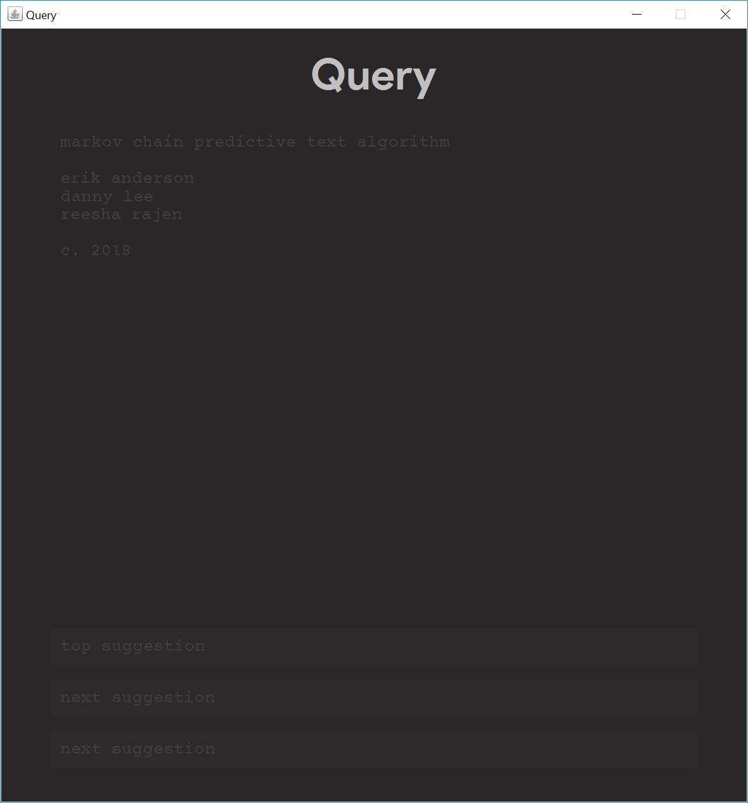
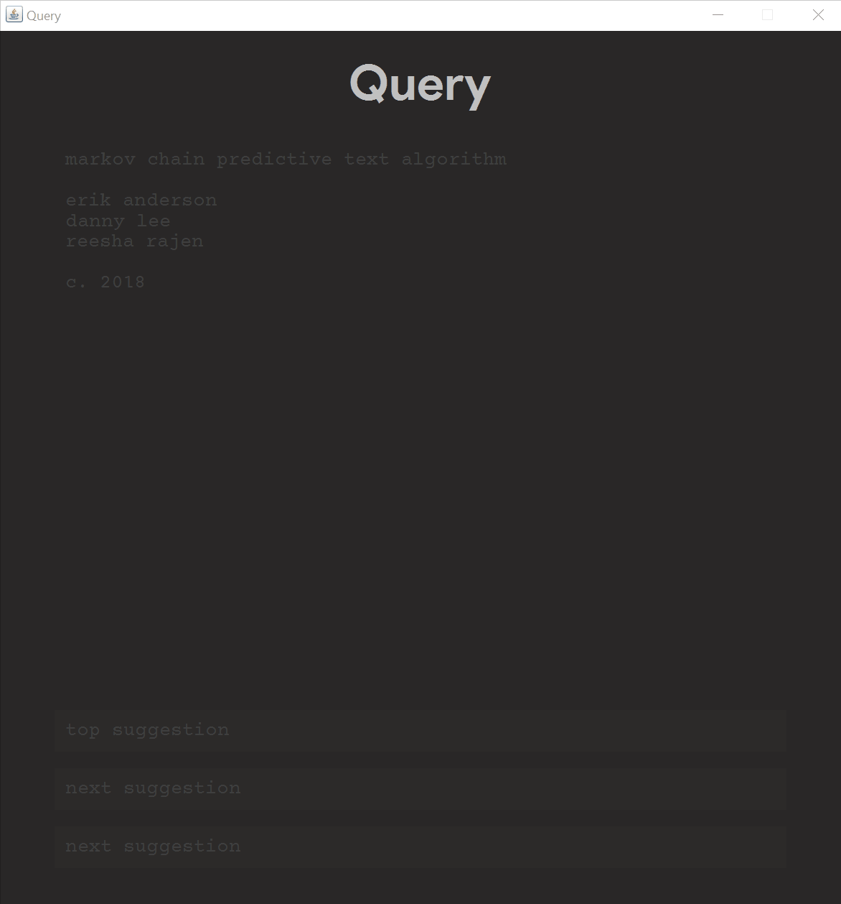
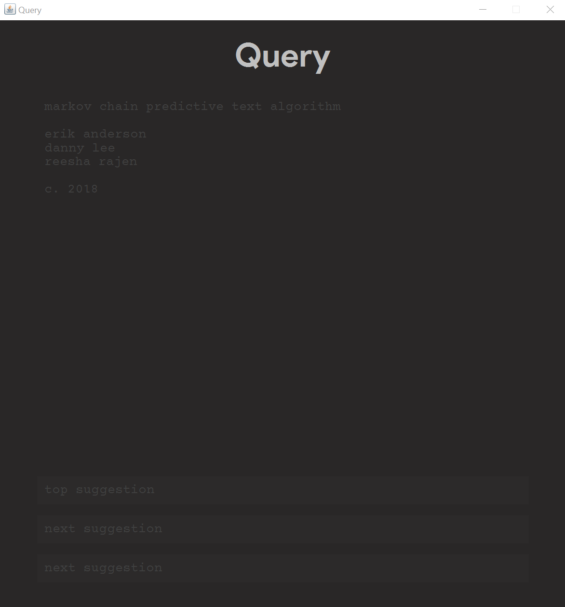

# Query

>In my Data Structures & Algorithms course, we were required to fully implement the `Graph` data structure, either as an adjacency list or adjacency matrix. We were also to utilize an advanced algorithm (Dijkstra's, Prim's, DFS, BFS, etc.).

## General program description
Utilizing a GUI frontend, my colleagues and I built a simple Markov predictive text generator, much like a search-engine itself. Called **Query**, due to utilizing a Priority Queue ADT in tandem with an adjacency list, this program serves as a connectivity query linking the user's most frequently used words to predict an entire search up to five (5) words.

## GUI
The three most popular phrases based on the last word typed by the user are displayed at the bottom of the interface. The user recieves a real time update with each word typed. Words themselves are delineated by the spacebar and parsed without the space. The user is able to continue typing as necessary within the main text field of the GUI, and is able to copy and paste this text into a multitude of other programs.

## Algorithm
This project utilizes a **Markov Chain**, or a stochastic model which describes a sequence of possible events in which the probability of each event depends only on the state attained in the previous event. The program quickly builds a network of text using a weighted, directed graph. The more inputs you feed it, the better Query will be.

## Demonstration:
See it in action below:

**Note**: when there is no adjacency detection to a target phrase, the GUI simply displays the `null` keyword in place of the first, second, and/or third result.

Imagine we now feed the text file with `Huffman tree java.`, `Huffman tree cpp.`, and `Huffman tree python`. Upon typing in `Huffman tree` into the search-engine, the user may expect to see either `java`, `cpp`, or `python` simply concatenated onto the ending of their search term. However, the graph now appears "smarter" than before. The program instantaneously rebuilds the entire network of text. As the graph is constructed, a breadth first search is performed to either add new edges or update the weight of previous adjacencies. We have just trained Query!

